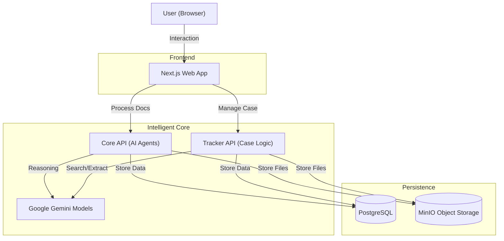

# LifeBridge 🌉
### *Bridging Borders with Artificial Intelligence*

**Submission for the VisaVerse AI Hackathon**

LifeBridge is an end-to-end, AI-powered platform designed to make global mobility accessible, transparent, and manageable. By leveraging Generative AI (Google Gemini), we transform complex immigration bureaucracies into clear, actionable pathways, removing the barriers that limit human opportunity.

---

## 🚀 Project Overview

### The Problem
Moving across borders is one of the most stressful and complex human experiences.
*   **Information Asymmetry**: Immigration laws are complex, changing, and buried in legalese.
*   **Fragmented Systems**: Applicants juggle disparate checklists, government portals, and physical documents.
*   **High Barriers**: Legal assistance is often prohibitively expensive, leaving millions to navigate the system alone.

### The Solution
LifeBridge acts as an **AI Co-pilot for Global Mobility**. It unifies the entire journey—from initial discovery to final approval—into a single, intelligent workspace.
*   **Understand**: AI analyzes user intent and documents to generate tailored checklists.
*   **Manage**: A "Case Spine" tracks every deadline, document, and task.
*   **Connect**: Location intelligence and effective AI search connect users to real-world support (Embassies & Attorneys).

---

## 🧠 How We Use AI (Meaningful Innovation)

We don't just "wrap" an LLM; we use AI to perform specialized cognitive tasks that were previously manual bottlenecks:

1.  **Intelligent Document Analysis ("The Clerk")**:
    *   **OCR & extraction** digitize physical documents.
    *   **Reasoning Agents** analyze documents for validity, expiration risks, and inconsistencies (e.g., "Passport expires before visa duration").

2.  **Generative Reasoning ("The Guide")**:
    *   LifeBridge uses **Google Gemini** to synthesize complex government requirements into simple, step-by-step plans tailored to the user's specific background.

3.  **AI-Powered Directory ("The Network")**:
    *   Unlike static directories, our **Attorney Search** uses AI to interpret natural language queries (e.g., "Spanish speaking lawyer for H1B in Miami") and aggregates scattered public contact info into actionable "Contact Cards".

---

## ⚡ Key Features

*   **🔍 Smart Intake & Checklist**: Converts a simple interview into a rigorous, evidence-linked project plan.
*   **📂 Digital Vault**: Secure storage that "reads" your files, tagging them automatically.
*   **🛡️ Risk Register**: Proactive warnings about gaps in your application before you file.
*   **🗺️ Location Intelligence**: Instant mapping of nearby Embassies and Consulates.
*   **🗣️ Voice & Multi-language**: Accessible design with text-to-speech and English/Spanish support for inclusive access.
*   **🤝 Collaborative Tracker**: A "TurboTax-like" experience for managing travel history, employment records, and tasks.

---

## 🛠️ Tech Stack & Architecture

LifeBridge adheres to a modern, scalable microservices architecture.

### **Frontend**
*   **Next.js 14 (App Router)**: Fast, server-rendered React application.
*   **Tailwind CSS & Framer Motion**: Responsive, accessible, and "wow"-factor design.
*   **Lucide React**: Consistent, high-quality iconography.

### **Backend & AI**
*   **FastAPI (Python)**: High-performance API layer.
*   **Google Gemini (via Vertex AI/Studio)**: The core reasoning engine.
*   **LangChain**: Orchestrating document splitting and context management.
*   **OCR Tools**: PyTesseract & PDFPlumber for ingestion.

### **Data & Infrastructure**
*   **PostgreSQL**: Relational storage for structured case data.
*   **MinIO (S3 Compatible)**: Object storage for document artifacts.
*   **Docker Compose**: Fully containerized local development environment.



---

## 🎥 Demo & Setup

### [Link to Demo Video (YouTube/Loom)]
*(Please insert your 2-5 min video link here)*

### Quickstart Guide

1.  **Prerequisites**: Docker & Docker Compose, Google API Key.
2.  **Clone**: `git clone <repo-url>`
3.  **Configure**: Create `.env` with your `GOOGLE_API_KEY`.
4.  **Run**:
    ```bash
    docker compose up --build
    ```
5.  **Access**:
    *   App: `http://localhost:3000`
    *   Docs: `http://localhost:8000/docs`

---

## 👥 Team Information

*   **Partha Samal** - Developer - *psama0214@gmail.com*
*   *[Add Team Member Name]* - *[Role]* - *[Email]*

---

## License

MIT License. Open exploration for a borderless world.
