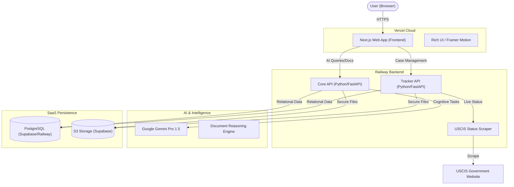

# LifeBridge 🌉
### *Bridging Borders with Artificial Intelligence*

**Submission for the VisaVerse AI Hackathon**

LifeBridge is an end-to-end, AI-powered platform designed to make global mobility accessible, transparent, and manageable. By leveraging Generative AI (Google Gemini), we transform complex immigration bureaucracies into clear, actionable pathways, removing the barriers that limit human opportunity.

---

## 🚀 Live Demo
*   **Web Portal**: [life-bridge-peach.vercel.app](https://life-bridge-peach.vercel.app)
*   **Core AI API**: [modest-wholeness-production-b698.up.railway.app](https://modest-wholeness-production-b698.up.railway.app)
*   **Case Tracker API**: [lifebridge-production.up.railway.app](https://lifebridge-production.up.railway.app)

---

## 🧠 Project Goal
The primary objective of LifeBridge is to democratize legal and immigration assistance. We aim to reduce the "complexity tax" paid by migrants by providing a unified, intelligent workspace that handles document analysis, regulatory research, and case tracking automatically.

---

## 🏗️ System Architecture

Our architecture is designed for scalability, security, and intelligence, splitting responsibilities between a high-performance frontend and specialized microservices.

---

## 🛠️ Tech Stack

### **Frontend Excellence**
*   **Next.js 14**: Leveraging App Router for high-performance streaming and SSR.
*   **Vanilla CSS + Tailwind**: Custom-tuned design system with a premium "Glassmorphism" aesthetic.
*   **Framer Motion**: Smooth micro-animations for an interactive feel.
*   **Lucide React**: Clean, modern iconography.

### **Intelligence Layer**
*   **Google Gemini Pro**: Orchestrates document synthesis, risk analysis, and attorney search.
*   **FastAPI**: Asynchronous Python framework powering our dual-API backbone.
*   **BeautifulSoup4**: Robust scraper for live government status updates.

### **Infrastructure & Security**
*   **Supabase**: Managed PostgreSQL and S3-compatible Object Storage for production-grade reliability.
*   **Railway**: Containerized deployment for Core and Tracker services.
*   **Vercel**: Global Edge hosting for the frontend.

---

## 📂 Environment Setup

To run LifeBridge locally or in production, ensure the following variables are configured:

### **Required Backend Keys**
*   `DATABASE_URL`: Your PostgreSQL connection string (Postgres/Supabase).
*   `GOOGLE_API_KEY`: Your Google AI Studio/Vertex API Key.
*   `CORS_ORIGINS`: `*` (for development) or your Vercel URL (for production).

### **Storage (S3 Compatible)**
*   `S3_ENDPOINT`: Your endpoint (e.g., Supabase S3 URL).
*   `S3_ACCESS_KEY`: Access key for bucket.
*   `S3_SECRET_KEY`: Secret key for bucket.
*   `S3_BUCKET_NAME`: `lifebridge-documents`.

### **Frontend Keys**
*   `NEXT_PUBLIC_API_URL`: URL of the Core API service.
*   `TRACKER_API_URL`: URL of the Tracker API service.

---

## 👥 Team Information
*   **Partha Samal** - Developer - *psama0214@gmail.com*

---

## License
MIT License. Open exploration for a borderless world.
