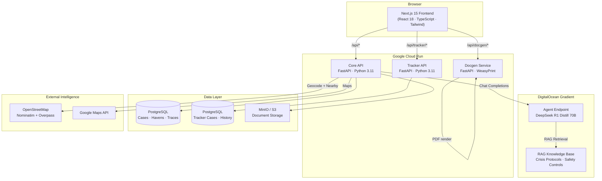
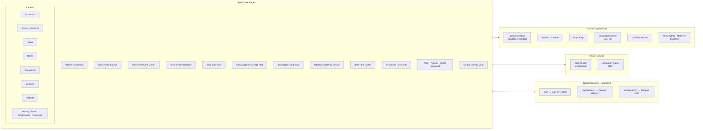
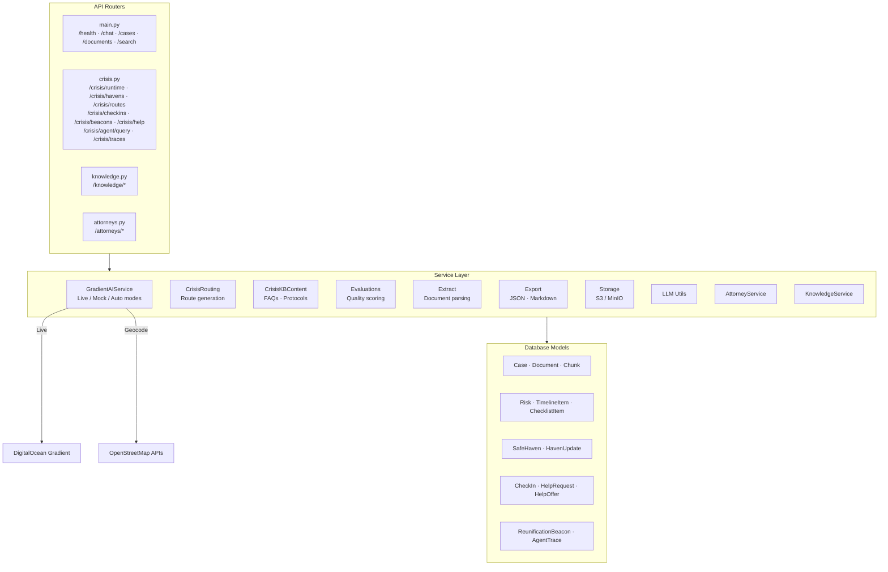
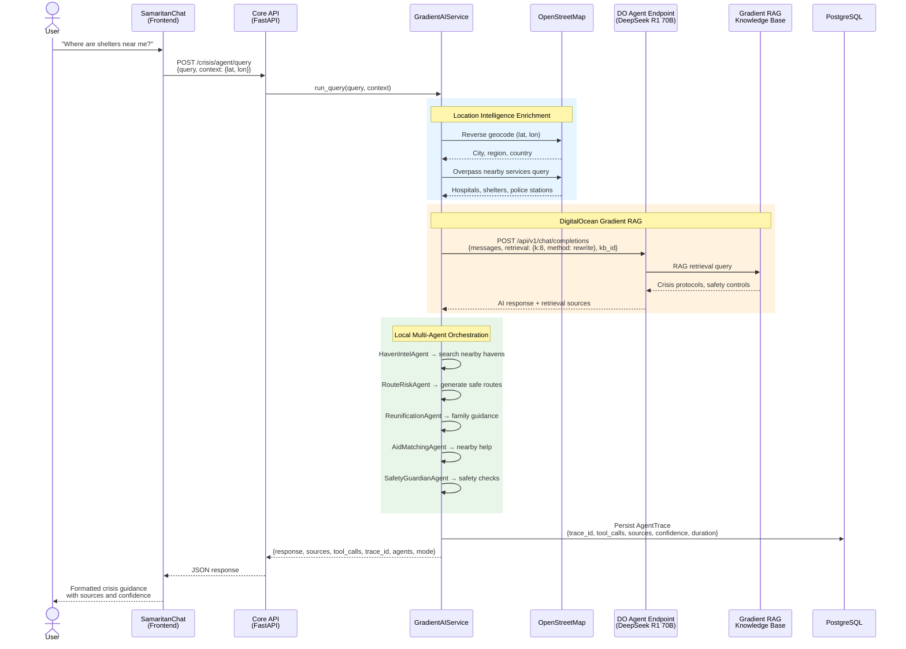
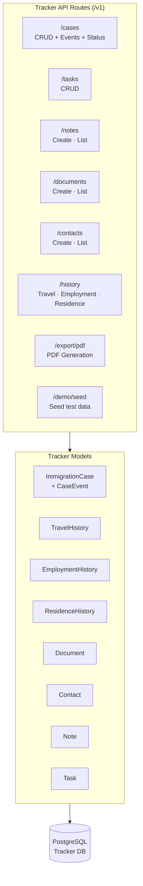
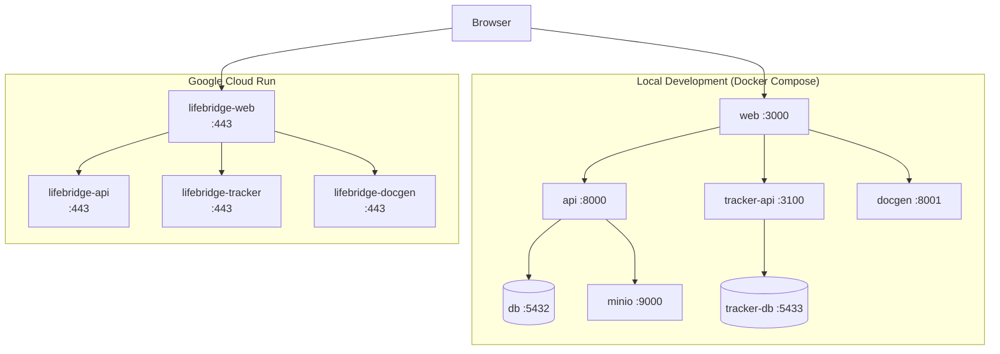

# LifeBridge

LifeBridge is a crisis navigation and reunification platform built for the **DigitalOcean Gradient AI Hackathon**.

Repository: [https://github.com/samalpartha/LifeBridge](https://github.com/samalpartha/LifeBridge)

## Hackathon Submission Focus

**One-line pitch:** Move people in crisis to safer nearby options with live AI guidance, risk-aware routes, and family reunification support.

**Judge-facing value:**
- Crisis-first flow (`/crisis-home` -> `/crisis`) optimized for urgent action
- Live DigitalOcean Gradient runtime with retrieval and traceable tool calls
- Real-time nearby intelligence + operational fallback for resilience
- End-to-end workflows: havens, routes, check-ins, beacons, and help matching

## DigitalOcean Gradient Implementation

LifeBridge uses Gradient in live mode through a DigitalOcean Agent endpoint.

- Live runtime status: `GET /crisis/runtime`
- Live connectivity probe: `GET /crisis/runtime/live-check`
- Agent orchestration query: `POST /crisis/agent/query`
- Retrieval-aware sources and persisted traces
- Runtime modes:
  - `live`: strict live DigitalOcean mode
  - `mock`: deterministic local fallback
  - `auto`: live when configured, fallback otherwise

Core implementation:
- `apps/api/app/services/gradient_ai.py`
- `apps/api/app/api/crisis.py`
- `apps/api/app/services/crisis_kb_content.py`
- `apps/api/app/services/evaluations.py`

## What Is Implemented

- Crisis command center pages:
  - `/crisis-home` (overview and launch)
  - `/crisis` (live operations console)
- Safe haven search with verification + service metadata
- Route generation with risk-aware options
- Safety check-ins with idempotency behavior
- Family reunification beacons (`create`, `lookup`, `update`)
- Nearby help request/offer matching
- Tracker workspace for case continuity (tasks, notes, history, documents)
- Knowledge and help surfaces integrated with live runtime indicators

---

## Architecture

### System Overview


```mermaid
flowchart TB
    subgraph Client["Browser"]
        WEB["Next.js 15 Frontend<br/>(React 18 · TypeScript · Tailwind)"]
    end

    subgraph CloudRun["Google Cloud Run"]
        API["Core API<br/>FastAPI · Python 3.11"]
        TRACKER["Tracker API<br/>FastAPI · Python 3.11"]
        DOCGEN["Docgen Service<br/>FastAPI · WeasyPrint"]
    end

    subgraph DigitalOcean["DigitalOcean Gradient"]
        AGENT["Agent Endpoint<br/>DeepSeek R1 Distill 70B"]
        KB["RAG Knowledge Base<br/>Crisis Protocols · Safety Controls"]
    end

    subgraph Data["Data Layer"]
        PG1[("PostgreSQL<br/>Cases · Havens · Traces")]
        PG2[("PostgreSQL<br/>Tracker Cases · History")]
        S3["MinIO / S3<br/>Document Storage"]
    end

    subgraph External["External Intelligence"]
        OSM["OpenStreetMap<br/>Nominatim + Overpass"]
        GMAPS["Google Maps API"]
    end

    WEB -- "/api/*" --> API
    WEB -- "/api/tracker/*" --> TRACKER
    WEB -- "/api/docgen/*" --> DOCGEN

    API --> PG1
    API --> S3
    API -- "Chat Completions" --> AGENT
    AGENT -- "RAG Retrieval" --> KB
    API -- "Geocode + Nearby" --> OSM
    API -- "Maps" --> GMAPS

    TRACKER --> PG2
    DOCGEN -- "PDF render" --> DOCGEN
```

### Frontend Architecture


```mermaid
flowchart LR
    subgraph Pages["App Router Pages"]
        direction TB
        HOME["/  Home Dashboard"]
        CH["/crisis-home  Launch"]
        CR["/crisis  Command Center"]
        RE["/reunion/:code  Beacon"]
        MAP["/map  Map View"]
        KN["/knowledge  Knowledge Hub"]
        KS["/knowledge/:slug  Topic"]
        ATT["/attorneys  Attorney Search"]
        HELP["/help  Help Center"]
        RES["/resources  Resources"]

        subgraph Tracker["/tracker/*"]
            TD["Dashboard"]
            TC["Cases · Cases/:id"]
            TT["Tasks"]
            TN["Notes"]
            TDOC["Documents"]
            TCON["Contacts"]
            TREP["Reports"]
            TH["History: Travel · Employment · Residence"]
        end

        AUTH["/login · /signup · /forgot-password"]
        VAULT["/vault  Evidence Vault"]
    end

    subgraph Components["Shared Components"]
        CHAT["SamaritanChat<br/>Gradient AI Chatbot"]
        NAV["NavBar + Sidebar"]
        LOGO["BrandLogo"]
        LANG["LanguageSwitcher<br/>EN / ES"]
        LIVE["LiveRuntimeCard"]
        AMAP["AttorneyMap · MapView<br/>Leaflet.js"]
    end

    subgraph Contexts["React Contexts"]
        AUTHC["AuthProvider<br/>localStorage"]
        LANGC["LanguageProvider<br/>i18n"]
    end

    subgraph Rewrites["Next.js Rewrites → Backend"]
        R1["/api/*  →  Core API :8000"]
        R2["/api/tracker/*  →  Tracker :3100/v1/*"]
        R3["/api/docgen/*  →  Docgen :8000"]
    end

    Pages --> Components
    Pages --> Contexts
    Pages --> Rewrites
```

### Backend Architecture (Core API)


```mermaid
flowchart TB
    subgraph Routers["API Routers"]
        MAIN["main.py<br/>/health · /chat · /cases · /documents · /search"]
        CRISIS["crisis.py<br/>/crisis/runtime · /crisis/havens · /crisis/routes<br/>/crisis/checkins · /crisis/beacons · /crisis/help<br/>/crisis/agent/query · /crisis/traces"]
        KNOW["knowledge.py<br/>/knowledge/*"]
        ATTY["attorneys.py<br/>/attorneys/*"]
    end

    subgraph Services["Service Layer"]
        GRAD["GradientAIService<br/>Live / Mock / Auto modes"]
        CRRT["CrisisRouting<br/>Route generation"]
        CRKB["CrisisKBContent<br/>FAQs · Protocols"]
        EVAL["Evaluations<br/>Quality scoring"]
        EXTR["Extract<br/>Document parsing"]
        EXPR["Export<br/>JSON · Markdown"]
        STOR["Storage<br/>S3 / MinIO"]
        LLM["LLM Utils"]
        ATTS["AttorneyService"]
        KBS["KnowledgeService"]
    end

    subgraph Models["Database Models"]
        direction LR
        M1["Case · Document · Chunk"]
        M2["Risk · TimelineItem · ChecklistItem"]
        M3["SafeHaven · HavenUpdate"]
        M4["CheckIn · HelpRequest · HelpOffer"]
        M5["ReunificationBeacon · AgentTrace"]
    end

    Routers --> Services
    Services --> Models
    GRAD --> |"Live"| DO["DigitalOcean Gradient"]
    GRAD --> |"Geocode"| OSM2["OpenStreetMap APIs"]
```

### Gradient AI Agent Flow


```mermaid
sequenceDiagram
    actor User
    participant Chat as SamaritanChat<br/>(Frontend)
    participant API as Core API<br/>(FastAPI)
    participant Grad as GradientAIService
    participant OSM as OpenStreetMap
    participant Agent as DO Agent Endpoint<br/>(DeepSeek R1 70B)
    participant KB as Gradient RAG<br/>Knowledge Base
    participant DB as PostgreSQL

    User->>Chat: "Where are shelters near me?"
    Chat->>API: POST /crisis/agent/query<br/>{query, context: {lat, lon}}
    API->>Grad: run_query(query, context)

    rect rgb(230, 245, 255)
        Note over Grad,OSM: Location Intelligence Enrichment
        Grad->>OSM: Reverse geocode (lat, lon)
        OSM-->>Grad: City, region, country
        Grad->>OSM: Overpass nearby services query
        OSM-->>Grad: Hospitals, shelters, police stations
    end

    rect rgb(255, 243, 224)
        Note over Grad,KB: DigitalOcean Gradient RAG
        Grad->>Agent: POST /api/v1/chat/completions<br/>{messages, retrieval: {k:8, method: rewrite}, kb_id}
        Agent->>KB: RAG retrieval query
        KB-->>Agent: Crisis protocols, safety controls
        Agent-->>Grad: AI response + retrieval sources
    end

    rect rgb(232, 245, 233)
        Note over Grad: Local Multi-Agent Orchestration
        Grad->>Grad: HavenIntelAgent → search nearby havens
        Grad->>Grad: RouteRiskAgent → generate safe routes
        Grad->>Grad: ReunificationAgent → family guidance
        Grad->>Grad: AidMatchingAgent → nearby help
        Grad->>Grad: SafetyGuardianAgent → safety checks
    end

    Grad->>DB: Persist AgentTrace<br/>{trace_id, tool_calls, sources, confidence, duration}
    Grad-->>API: {response, sources, tool_calls, trace_id, agents, mode}
    API-->>Chat: JSON response
    Chat-->>User: Formatted crisis guidance<br/>with sources and confidence
```

### Tracker API Architecture


```mermaid
flowchart TB
    subgraph TrackerRoutes["Tracker API Routes  (/v1)"]
        CASES["/cases<br/>CRUD + Events + Status"]
        TASKS["/tasks<br/>CRUD"]
        NOTES["/notes<br/>Create · List"]
        DOCS["/documents<br/>Create · List"]
        CONTACTS["/contacts<br/>Create · List"]
        HIST["/history<br/>Travel · Employment · Residence"]
        EXPORT["/export/pdf<br/>PDF Generation"]
        DEMO["/demo/seed<br/>Seed test data"]
    end

    subgraph TrackerModels["Tracker Models"]
        IC["ImmigrationCase<br/>+ CaseEvent"]
        TH2["TravelHistory"]
        EH["EmploymentHistory"]
        RH["ResidenceHistory"]
        DOC2["Document"]
        CON["Contact"]
        NOTE2["Note"]
        TASK2["Task"]
    end

    TrackerRoutes --> TrackerModels
    TrackerModels --> PG3[("PostgreSQL<br/>Tracker DB")]
```

### Deployment Architecture


```mermaid
flowchart TB
    subgraph GCR["Google Cloud Run"]
        direction LR
        FE["lifebridge-web<br/>:443"]
        BE["lifebridge-api<br/>:443"]
        TR["lifebridge-tracker<br/>:443"]
        DG["lifebridge-docgen<br/>:443"]
    end

    subgraph Docker["Local Development (Docker Compose)"]
        direction LR
        FE2["web :3000"]
        BE2["api :8000"]
        TR2["tracker-api :3100"]
        DG2["docgen :8001"]
        DB2[("db :5432")]
        TDB[("tracker-db :5433")]
        MIN["minio :9000"]
    end

    BROWSER["Browser"] --> FE
    BROWSER --> FE2

    FE --> BE
    FE --> TR
    FE --> DG
    FE2 --> BE2
    FE2 --> TR2
    FE2 --> DG2
    BE2 --> DB2
    BE2 --> MIN
    TR2 --> TDB
```

## Quick Start

### Option A: Docker

```bash
cp .env.example .env
# Fill Gradient credentials for live mode
docker compose up --build
```

### Option B: Local ports (recommended for demo)

```bash
# Terminal 1: Core API
CORS_ORIGINS=http://localhost:3009,http://127.0.0.1:3009 \
./.venv/bin/python -m uvicorn app.main:app --app-dir apps/api --host 127.0.0.1 --port 8009 --reload

# Terminal 2: Tracker API
cd apps/tracker-api
DATABASE_URL="sqlite:///./tracker.db" ../../.venv/bin/python -m uvicorn app.main:app --host 127.0.0.1 --port 3100 --reload

# Terminal 3: Frontend
cd apps/web
NEXT_PUBLIC_API_URL=http://127.0.0.1:8009 npm run dev -- -p 3009
```

## Required Environment Variables (Live Gradient)

Configure one of these live paths:

- Endpoint mode:
  - `GRADIENT_AGENT_ENDPOINT`
  - `GRADIENT_AGENT_ACCESS_KEY`
- SDK mode:
  - `GRADIENT_ACCESS_TOKEN`
  - `GRADIENT_WORKSPACE_ID`

Additional runtime:

```env
GRADIENT_RUNTIME_MODE=live
GRADIENT_AGENT_ID=
GRADIENT_KNOWLEDGE_BASE_ID=
GRADIENT_DEFAULT_RETRIEVAL_K=8
GRADIENT_SUB_QUERY_RETRIEVAL_K=12
```

## Live Deployment (Google Cloud Run)

| Service | URL |
|---------|-----|
| Frontend | [https://lifebridge-web-365415503294.us-central1.run.app](https://lifebridge-web-365415503294.us-central1.run.app) |
| Core API | [https://lifebridge-api-365415503294.us-central1.run.app](https://lifebridge-api-365415503294.us-central1.run.app) |
| Tracker API | [https://lifebridge-tracker-365415503294.us-central1.run.app](https://lifebridge-tracker-365415503294.us-central1.run.app) |
| Docgen API | [https://lifebridge-docgen-365415503294.us-central1.run.app](https://lifebridge-docgen-365415503294.us-central1.run.app) |

## Demo Verification Checklist

1. Open the live frontend or `http://localhost:3009/crisis-home`
2. Launch Crisis Mode and verify live indicators on `/crisis`
3. Call live runtime probe: `https://lifebridge-api-365415503294.us-central1.run.app/crisis/runtime/live-check`
4. Create beacon and open `/reunion/{code}`
5. Submit help request + offer and verify nearby matching
6. Open tracker pages and confirm data persists

## Testing

```bash
# Core API tests
cd apps/api && ../../.venv/bin/pytest tests -q

# Tracker API tests
cd apps/tracker-api && ../../.venv/bin/pytest tests -q

# Docgen tests
cd apps/docgen && ../../.venv/bin/pytest tests -q

# Frontend build and smoke
cd apps/web
npm run build
npx playwright test tests/smoke.spec.ts
```

## Important API Endpoints

All crisis endpoints are under `/crisis`:
- `GET /runtime`
- `GET /runtime/live-check`
- `POST /havens`
- `GET /havens/search`
- `POST /routes/generate`
- `POST /checkins`
- `POST /beacons`
- `GET /beacons/{beacon_code}`
- `POST /help/requests`
- `GET /help/requests/nearby`
- `POST /help/offers`
- `GET /help/offers/nearby`
- `POST /agent/query`
- `GET /traces`

## Links

- GitHub: [https://github.com/samalpartha/LifeBridge](https://github.com/samalpartha/LifeBridge)
- Live app: [https://lifebridge-web-365415503294.us-central1.run.app](https://lifebridge-web-365415503294.us-central1.run.app)
- Live API docs: [https://lifebridge-api-365415503294.us-central1.run.app/docs](https://lifebridge-api-365415503294.us-central1.run.app/docs)
- Live Tracker docs: [https://lifebridge-tracker-365415503294.us-central1.run.app/docs](https://lifebridge-tracker-365415503294.us-central1.run.app/docs)
- API docs (local): `http://127.0.0.1:8009/docs`
- Tracker docs (local): `http://127.0.0.1:3100/docs`

## License

MIT (`LICENSE`)
