#  LifeBridge 🌉

### *Bridging Borders with Artificial Intelligence*

  

**Submission for the VisaVerse AI Hackathon**

LifeBridge is an end-to-end, AI-powered platform designed to make global mobility accessible, transparent, and manageable. By leveraging Generative AI (Google Gemini), we transform complex immigration bureaucracies into clear, actionable pathways, removing the barriers that limit human opportunity.

---

## 🚀 Live Access

| Component | URL | Description |
|-----------|-----|-------------|
| **Frontend Portal** | [**life-bridge-peach.vercel.app**](https://life-bridge-peach.vercel.app/) | The main user interface for migrants and advisors. |
| **Tracker API** | [**Docs & Swagger**](https://lifebridge-production.up.railway.app/docs) | Case management, events, and USCIS integration. |
| **Core AI API** | [**Docs & Swagger**](https://modest-wholeness-production-b698.up.railway.app/docs) | Document reasoning, risk analysis, and LLM orchestration. |

*(Click the icon above to launch the application)*

---

## 🏗️ Architecture

LifeBridge uses a distributed microservices architecture to separate concern between real-time user interaction and heavy cognitive processing.

### **Full System Overview**
High-level view of how the entire ecosystem connects, from the user's browser to our AI and Government integrations.

```mermaid
graph TD
    %% Nodes
    User(("👤 User"))
    
    subgraph Frontend_Vercel ["🖥️ Frontend (Vercel)"]
        NextJS["Next.js 14 App"]
    end
    
    subgraph Backend_Railway ["⚙️ Backend (Railway)"]
        Tracker["📄 Tracker API"]
        Core["🧠 Core AI API"]
    end
    
    subgraph Data_Layer ["💾 Persistence"]
        DB[("PostgreSQL")]
        S3[("S3 Storage")]
    end
    
    subgraph External_Services ["🌐 External Integrations"]
        Gemini["✨ Google Gemini Pro"]
        USCIS["🏛️ USCIS.gov"]
    end

    %% Flows
    User == HTTPS ==> NextJS
    
    NextJS -- "REST / JSON" --> Tracker
    NextJS -- "REST / JSON" --> Core
    
    Tracker -- "Read/Write" --> DB
    Tracker -- "Store Docs" --> S3
    
    Tracker -. "Scrape Status" .-> USCIS
    Core -- "Reasoning" --> Gemini
    
    %% Styling
    classDef primary fill:#2563eb,stroke:#1d4ed8,color:white;
    classDef secondary fill:#4f46e5,stroke:#4338ca,color:white;
    classDef db fill:#059669,stroke:#047857,color:white;
    classDef ext fill:#d97706,stroke:#b45309,color:white;
    
    class NextJS primary;
    class Tracker,Core secondary;
    class DB,S3 db;
    class Gemini,USCIS ext;
```

### **Frontend Architecture**
Built on **Next.js 14**, the frontend provides a reactive, "app-like" experience.

*   **Framework**: Next.js 14 (App Router)
*   **Styling**: Tailwind CSS + Framer Motion (Glassmorphism design system)
*   **State**: React Context (Auth, Language) + SWR
*   **Testing**: Playwright (E2E) + Vitest (Unit)

### **Backend Architecture**
Two specialized **FastAPI** services power the logic, deployed on Railway.

*   **Tracker Service**: Manages long-lived persistence (User history, Cases, Tasks). Connects to PostgreSQL.
*   **Core Service**: Stateless intelligence engine. handles OCR, LLM Chains, and RAG.

---

## 🛠️ Key Technologies

### **Frontend Excellence**
*   **Next.js 14**: Server Side Rendering for SEO and speed.
*   **TailwindCSS**: Rapid, utility-first styling.
*   **Framer Motion**: Premium animations.
*   **Lucide React**: Vector iconography.

### **Backend Intelligence**
*   **FastAPI**: Python's modern async framework.
*   **Google Gemini Pro 1.5**: The brain behind document analysis.
*   **SQLAlchemy + Pydantic**: Robust data modeling.
*   **BeautifulSoup4**: Real-time government site scraping.
*   **Playwright**: For verified end-to-end reliability.

---

## 👥 Team Information

**Partha Sarathi Samal**
*Lead Architect & Full Stack Engineer*
Orchestrated the microservices architecture, implemented the comprehensive testing strategy, and led the integration of Google Gemini AI.

**Suresh Kumar Palus**
*Frontend Lead & UX Designer*
Designed the premium "Glassmorphism" user interface, developed the dynamic React component library, and ensured a seamless mobile-responsive experience.

---

## 📜 License
MIT License. Open exploration for a global future.
