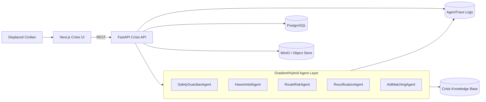

# Architecture

## System Overview

## Runtime Model

- `mock`: deterministic local orchestration, always available
- `live`: uses DigitalOcean Gradient credentials and live agent execution
- `auto`: tries live and falls back to mock if unavailable

## Primary User Journey

1. User opens crisis console and grants location.
2. HavenIntel returns nearby verified havens.
3. RouteRisk returns 3 route options with reasons.
4. User check-ins and can create reunification beacon.
5. Help requests/offers are matched by proximity and category.
6. Copilot call logs traces with tools, sources, confidence, duration.
